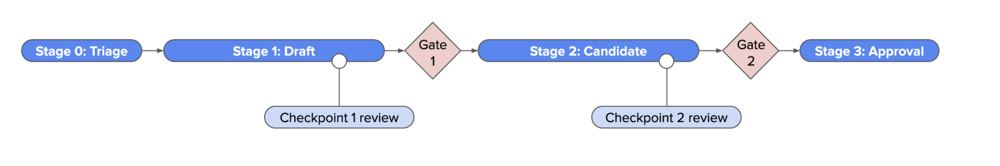

# pdap-reviews

This repository is the central store of public reviews for products moving through GA4GH's Product Development and Approval Process (PDAP). You can find the reviews for each product for each stage of the lifecycle from stage 0 to the reviews supporting the two major checkpoints.

# Reviews by group

## TASC

You can find TASC reviews within the [TASC folder](./tasc/).

# Issues

Issues are raised to trigger reviews and are the way to trigger the start of a review. Conclusions of the review will be placed here under the TASC user.
